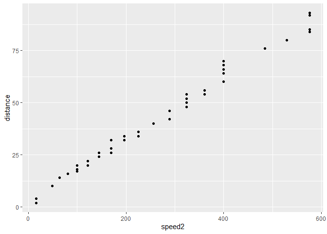

Setting up R Studio
===================

``` r
library(readr)
library(tidyverse)
library(ggplot2)
```

Predicting braking distance of cars based on speed
==================================================

Importing dataset
-----------------

The data of different brands of cars has been considered for this
analysis. The dataset used contains 50 observations.

``` r
cars <- read_csv("~/Ubiqum/Data Analytics Course/Module II/Task 1/R Tutorial Data/cars.csv")
```

    ## Parsed with column specification:
    ## cols(
    ##   `name of car` = col_character(),
    ##   `speed of car` = col_double(),
    ##   `distance of car` = col_double()
    ## )

Exploring the data
------------------

``` r
summary(cars)
```

    ##  name of car         speed of car  distance of car 
    ##  Length:50          Min.   : 4.0   Min.   :  2.00  
    ##  Class :character   1st Qu.:12.0   1st Qu.: 26.00  
    ##  Mode  :character   Median :15.0   Median : 36.00  
    ##                     Mean   :15.4   Mean   : 42.98  
    ##                     3rd Qu.:19.0   3rd Qu.: 56.00  
    ##                     Max.   :25.0   Max.   :120.00

``` r
str(cars)
```

    ## Classes 'spec_tbl_df', 'tbl_df', 'tbl' and 'data.frame': 50 obs. of  3 variables:
    ##  $ name of car    : chr  "Ford" "Jeep" "Honda" "KIA" ...
    ##  $ speed of car   : num  4 4 7 7 8 9 10 10 10 11 ...
    ##  $ distance of car: num  2 4 10 10 14 16 17 18 20 20 ...
    ##  - attr(*, "spec")=
    ##   .. cols(
    ##   ..   `name of car` = col_character(),
    ##   ..   `speed of car` = col_double(),
    ##   ..   `distance of car` = col_double()
    ##   .. )

``` r
attributes(cars)
```

    ## $names
    ## [1] "name of car"     "speed of car"    "distance of car"
    ## 
    ## $class
    ## [1] "spec_tbl_df" "tbl_df"      "tbl"         "data.frame" 
    ## 
    ## $row.names
    ##  [1]  1  2  3  4  5  6  7  8  9 10 11 12 13 14 15 16 17 18 19 20 21 22 23
    ## [24] 24 25 26 27 28 29 30 31 32 33 34 35 36 37 38 39 40 41 42 43 44 45 46
    ## [47] 47 48 49 50
    ## 
    ## $spec
    ## cols(
    ##   `name of car` = col_character(),
    ##   `speed of car` = col_double(),
    ##   `distance of car` = col_double()
    ## )

For convenicen the headers of the data frame have been chenged as
follows:

``` r
names(cars) <- c("brand", "speed", "distance")
```

### Histograms

``` r
hist(cars$speed, breaks = 25)
```


``` r
hist(cars$distance, breaks = 120)
```


As can be seen in the histogram of distance, there is one outlier
(observation on the far right). This can be more clearly seen in the
boxplot below.

### Other plots

1 –\> cars speed 2 –\> cars distance


Looking at the boxplot for the cars distance (2) one outlier can be
spoted with a value of 120.

### Normal Q-Q Plot for cars speed


In the figure above it can be appreciated that the distribution of car
speeds is close to a normal distribution.

### Normal Q-Q Plot for cars braking distance


The figure above shows that the distribution of cars braking distances
is less normal than the one of cars speeds.

### Variable transformation

Considering that the brake distance is as per the laws of physics
correlated to the speed to the power of two (2), the independent
variable will be transformed as speed^2.

``` r
cars_trans <- cars
names(cars_trans) <- c("brand", "speed2", "distance")
cars_trans$speed2 <- cars$speed * cars$speed
ggplot(cars_trans, aes(speed2, distance)) + geom_point()
```


It can be seen in the figure above that the relationship between braking
distance and speed^2 is closed to a stright line.

### Removing outliers

``` r
outlier_value <- boxplot(cars_trans$distance, plot = F)$out
outlier_index <- which(cars_trans$distance == outlier_value)
cars_no_outlier <- cars_trans[-outlier_index,]
ggplot(cars_no_outlier, aes(speed2, distance)) + geom_point()
```



Modeling - Linear regression
----------------------------

### Creating testing and training sets

``` r
set.seed(123)
trainsize <- round(nrow(cars_no_outlier)*.7)
testsize <- nrow(cars_no_outlier) - trainsize
trainsize
```

    ## [1] 34

``` r
testsize
```

    ## [1] 15

``` r
training_indices <- sample(seq_len(nrow(cars_no_outlier)), trainsize)
trainset <- cars_no_outlier[training_indices,]
testset <- cars_no_outlier[-training_indices,]
```

Trainset

    ## # A tibble: 34 x 3
    ##    brand      speed2 distance
    ##    <chr>       <dbl>    <dbl>
    ##  1 GM            289       46
    ##  2 Nissan        144       26
    ##  3 Mitsubishi    144       26
    ##  4 Honda          49       10
    ##  5 Dodge         400       68
    ##  6 Acura         400       70
    ##  7 Mitsubishi    361       56
    ##  8 Jeep          576       85
    ##  9 Jeep          225       36
    ## 10 Honda         225       36
    ## # ... with 24 more rows

Testset

    ## # A tibble: 15 x 3
    ##    brand     speed2 distance
    ##    <chr>      <dbl>    <dbl>
    ##  1 Ford          16        2
    ##  2 Jeep          16        4
    ##  3 BMW           81       16
    ##  4 GMC          169       26
    ##  5 Chrysler     169       28
    ##  6 Acura        196       32
    ##  7 Chevrolet    196       34
    ##  8 Ford         225       34
    ##  9 Hyundai      324       48
    ## 10 Infiniti     324       50
    ## 11 Mazda        361       54
    ## 12 Nissan       361       56
    ## 13 Chrysler     400       66
    ## 14 Audi         484       76
    ## 15 Buick        576       84

### Training the model - linear regression

In the table below the error metrics of the linear regression are
summarized. To highlight is the following:

-   The R2 is of 0.99 which denotes a very good fit to the data points.
-   t-values are 3.982 for Intercept and 55.337 for speed’s coeficient.
    Since both are \> 2 we can saz there is a strong correlation between
    the distance and speed, which we expect to be.
-   p-value: \< 2.2e-16. P-value lower than 0.05 accounts also for a
    high correlation

``` r
lm_cars <- lm(distance ~ speed2, trainset)
summary(lm_cars)
```

    ## 
    ## Call:
    ## lm(formula = distance ~ speed2, data = trainset)
    ## 
    ## Residuals:
    ##    Min     1Q Median     3Q    Max 
    ## -4.861 -1.218 -0.597  1.139  6.611 
    ## 
    ## Coefficients:
    ##             Estimate Std. Error t value Pr(>|t|)    
    ## (Intercept) 3.227165   0.810508   3.982 0.000369 ***
    ## speed2      0.150405   0.002718  55.337  < 2e-16 ***
    ## ---
    ## Signif. codes:  0 '***' 0.001 '**' 0.01 '*' 0.05 '.' 0.1 ' ' 1
    ## 
    ## Residual standard error: 2.423 on 32 degrees of freedom
    ## Multiple R-squared:  0.9897, Adjusted R-squared:  0.9893 
    ## F-statistic:  3062 on 1 and 32 DF,  p-value: < 2.2e-16

### Testing the model - prediction on test sample

``` r
prediction_cars <- predict(lm_cars, testset)
error_pred_cars <- testset$distance - prediction_cars
testset <- cbind(testset, prediction_cars, error_pred_cars)
testset$abs_error <- abs(testset$error_pred_cars)
```

Testset showing prediction and error of predictions

``` r
testset
```

    ##        brand speed2 distance prediction_cars error_pred_cars  abs_error
    ## 1       Ford     16        2        5.633647     -3.63364683 3.63364683
    ## 2       Jeep     16        4        5.633647     -1.63364683 1.63364683
    ## 3        BMW     81       16       15.409978      0.59002178 0.59002178
    ## 4        GMC    169       26       28.645627     -2.64562688 2.64562688
    ## 5   Chrysler    169       28       28.645627     -0.64562688 0.64562688
    ## 6      Acura    196       32       32.706565     -0.70656454 0.70656454
    ## 7  Chevrolet    196       34       32.706565      1.29343546 1.29343546
    ## 8       Ford    225       34       37.068312     -3.06831239 3.06831239
    ## 9    Hyundai    324       48       51.958417     -3.95841713 3.95841713
    ## 10  Infiniti    324       50       51.958417     -1.95841713 1.95841713
    ## 11     Mazda    361       54       57.523406     -3.52340577 3.52340577
    ## 12    Nissan    361       56       57.523406     -1.52340577 1.52340577
    ## 13  Chrysler    400       66       63.389205      2.61079539 2.61079539
    ## 14      Audi    484       76       76.023233     -0.02323287 0.02323287
    ## 15     Buick    576       84       89.860502     -5.86050192 5.86050192

The MAE of the prediction is the following:

``` r
mean(testset$abs_error)
```

    ## [1] 2.245004

In the figure below it can be seen the data points of the testset
together with the predicted distance values.

``` r
ggplot(testset, aes(speed2)) + geom_point(aes(y = distance), color = "blue") + geom_line(aes(y = prediction_cars), color = "orange")
```


Predicting petal width based on petal length
============================================

Importing dataset
-----------------

``` r
IrisDataset <- read.csv("~/Ubiqum/Data Analytics Course/Module II/Task 1/R Tutorial Data/iris.csv", header=TRUE, sep=",")
```

Exploring the data
------------------

``` r
attributes(IrisDataset)
```

    ## $names
    ## [1] "X"            "Sepal.Length" "Sepal.Width"  "Petal.Length"
    ## [5] "Petal.Width"  "Species"     
    ## 
    ## $class
    ## [1] "data.frame"
    ## 
    ## $row.names
    ##   [1]   1   2   3   4   5   6   7   8   9  10  11  12  13  14  15  16  17
    ##  [18]  18  19  20  21  22  23  24  25  26  27  28  29  30  31  32  33  34
    ##  [35]  35  36  37  38  39  40  41  42  43  44  45  46  47  48  49  50  51
    ##  [52]  52  53  54  55  56  57  58  59  60  61  62  63  64  65  66  67  68
    ##  [69]  69  70  71  72  73  74  75  76  77  78  79  80  81  82  83  84  85
    ##  [86]  86  87  88  89  90  91  92  93  94  95  96  97  98  99 100 101 102
    ## [103] 103 104 105 106 107 108 109 110 111 112 113 114 115 116 117 118 119
    ## [120] 120 121 122 123 124 125 126 127 128 129 130 131 132 133 134 135 136
    ## [137] 137 138 139 140 141 142 143 144 145 146 147 148 149 150

``` r
summary(IrisDataset)
```

    ##        X           Sepal.Length    Sepal.Width     Petal.Length  
    ##  Min.   :  1.00   Min.   :4.300   Min.   :2.000   Min.   :1.000  
    ##  1st Qu.: 38.25   1st Qu.:5.100   1st Qu.:2.800   1st Qu.:1.600  
    ##  Median : 75.50   Median :5.800   Median :3.000   Median :4.350  
    ##  Mean   : 75.50   Mean   :5.843   Mean   :3.057   Mean   :3.758  
    ##  3rd Qu.:112.75   3rd Qu.:6.400   3rd Qu.:3.300   3rd Qu.:5.100  
    ##  Max.   :150.00   Max.   :7.900   Max.   :4.400   Max.   :6.900  
    ##   Petal.Width          Species  
    ##  Min.   :0.100   setosa    :50  
    ##  1st Qu.:0.300   versicolor:50  
    ##  Median :1.300   virginica :50  
    ##  Mean   :1.199                  
    ##  3rd Qu.:1.800                  
    ##  Max.   :2.500

``` r
str(IrisDataset)
```

    ## 'data.frame':    150 obs. of  6 variables:
    ##  $ X           : int  1 2 3 4 5 6 7 8 9 10 ...
    ##  $ Sepal.Length: num  5.1 4.9 4.7 4.6 5 5.4 4.6 5 4.4 4.9 ...
    ##  $ Sepal.Width : num  3.5 3 3.2 3.1 3.6 3.9 3.4 3.4 2.9 3.1 ...
    ##  $ Petal.Length: num  1.4 1.4 1.3 1.5 1.4 1.7 1.4 1.5 1.4 1.5 ...
    ##  $ Petal.Width : num  0.2 0.2 0.2 0.2 0.2 0.4 0.3 0.2 0.2 0.1 ...
    ##  $ Species     : Factor w/ 3 levels "setosa","versicolor",..: 1 1 1 1 1 1 1 1 1 1 ...

``` r
names(IrisDataset)
```

    ## [1] "X"            "Sepal.Length" "Sepal.Width"  "Petal.Length"
    ## [5] "Petal.Width"  "Species"

``` r
IrisDataset$Species<- as.numeric(IrisDataset$Species)
hist(IrisDataset$Species)
```


``` r
hist(IrisDataset$Petal.Length, breaks = 50)
```


``` r
boxplot(IrisDataset$Petal.Length)
```


``` r
hist(IrisDataset$Petal.Width, breaks = 50)
```


``` r
boxplot(IrisDataset$Petal.Width)
```


``` r
ggplot(IrisDataset, aes(Petal.Length, Petal.Width)) + geom_point()
```


``` r
qqnorm(IrisDataset$Petal.Length)
```


Training the model - linear regression
--------------------------------------

``` r
set.seed(123)
trainSize <- round(nrow(IrisDataset) * 0.2)
testSize <- nrow(IrisDataset) - trainSize
trainSize
```

    ## [1] 30

``` r
testSize
```

    ## [1] 120

``` r
train_indic <- sample(seq_len(nrow(IrisDataset)),trainSize)
trainSet <- IrisDataset[train_indic, ]
testSet <- IrisDataset[-train_indic, ]
set.seed(405)
trainSet <- IrisDataset[train_indic, ]
testSet <- IrisDataset[-train_indic, ]
lm_iris <- lm(Petal.Width ~ Petal.Length, trainSet)
summary(lm_iris)
```

    ## 
    ## Call:
    ## lm(formula = Petal.Width ~ Petal.Length, data = trainSet)
    ## 
    ## Residuals:
    ##      Min       1Q   Median       3Q      Max 
    ## -0.36964 -0.10766  0.00591  0.08338  0.47607 
    ## 
    ## Coefficients:
    ##              Estimate Std. Error t value Pr(>|t|)    
    ## (Intercept)  -0.28053    0.07150  -3.923 0.000516 ***
    ## Petal.Length  0.39365    0.01684  23.381  < 2e-16 ***
    ## ---
    ## Signif. codes:  0 '***' 0.001 '**' 0.01 '*' 0.05 '.' 0.1 ' ' 1
    ## 
    ## Residual standard error: 0.1742 on 28 degrees of freedom
    ## Multiple R-squared:  0.9513, Adjusted R-squared:  0.9495 
    ## F-statistic: 546.7 on 1 and 28 DF,  p-value: < 2.2e-16

### Testing the model - prediction on test sample

``` r
prediction_iris <- predict(lm_iris, testSet)
error_pred_iris <- testSet$Petal.Width - prediction_iris
testSet <- cbind(testSet, prediction_iris, error_pred_iris)
ggplot(testSet, aes(Petal.Length)) + geom_point(aes(y = Petal.Width), color = "blue") + geom_line(aes(y = prediction_iris), color = "orange")
```


